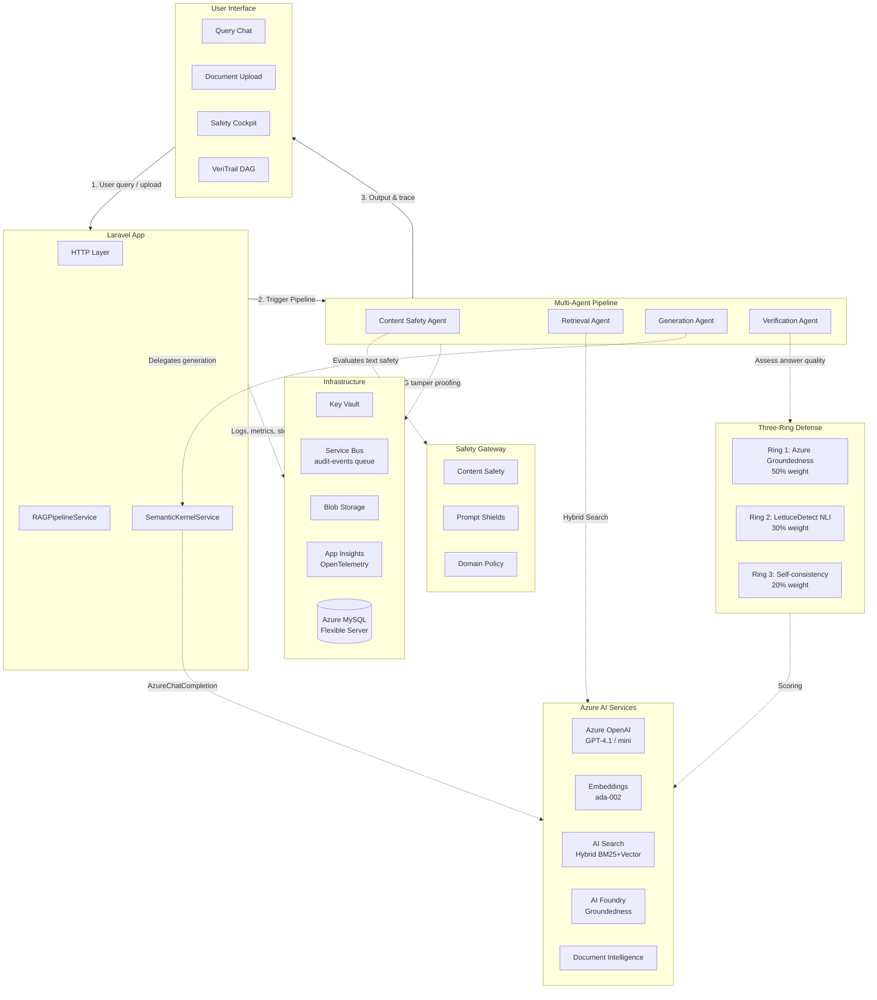

<div align="center">
  
</div>

# 🔬 Axiomeer: The AI-Powered Grounded Intelligence Platform for Regulated Domains

[](https://azure.microsoft.com/)
[](https://aka.ms/innovate-challenge)
[](https://laravel.com/)
[](https://www.php.net/)
[](https://github.com/microsoft/semantic-kernel)
[](https://opensource.org/licenses/MIT)

---

## 🌟 Introduction

**Axiomeer** is a multi-agent, Retrieval-Augmented Generation (RAG) platform purpose-built for **Legal, Healthcare, and Finance** professionals — the domains where a single hallucinated AI answer can end a career, harm a patient, or trigger a regulatory violation.

Unlike generic AI chatbots, Axiomeer treats every answer as **guilty until proven grounded**. Before any response reaches the user, it passes through a four-stage agent pipeline and a unique **Three-Ring Hallucination Defense** — three independent verification mechanisms that score, flag, and block unverified claims. Every answer is traced through a **VeriTrail DAG** (Directed Acyclic Graph) that shows exactly which documents, chunks, and claims were used to construct it.

The result: AI that regulated professionals can actually trust and audit.

Powerpoint Link - https://github.com/Axiomeer/Axiomeer/blob/93098ae6cf7321baa93a45d9baa69a4b52757418/Axiomeer.pptx
---

## 📝 Table of Contents

1. [Introduction](#-introduction)
2. [The Problem](#️-the-problem)
3. [Our Solution](#-our-solution)
4. [Key Features](#-key-features)
5. [System Architecture](#️-system-architecture)
6. [Technology Stack](#️-technology-stack)
7. [Quick Start](#-quick-start)
8. [Project Screenshots](#-project-screenshots)
9. [Responsible AI Commitment](#-responsible-ai-commitment)
10. [Team Members](#-team-members)
11. [License](#-license)

---

## ⚠️ The Problem

Regulated professionals — lawyers, clinicians, financial advisors — are turning to AI at record rates. But every major AI system shares the same fatal flaw for high-stakes domains: **hallucination with no accountability**.

- A healthcare query returns a fabricated drug interaction — and a clinician acts on it.
- A legal AI cites a non-existent case — and a junior associate includes it in a brief.
- A finance AI misquotes a regulation — and a firm files a non-compliant report.

Generic RAG systems give you an answer and a list of sources. They don't tell you whether the answer is *actually supported* by those sources. They have no per-domain safety policies, no provenance trail, and no way to know when they've gone beyond what the documents say.

The problem isn't AI being wrong — it's AI being wrong **silently, confidently, and untraceably.**

---

## 💡 Our Solution

Axiomeer is a grounded intelligence platform that intercepts every query and answers the question every regulated professional needs to ask: *"Can I actually trust this answer — and prove why?"*

```
User Question → Safety Screening → Hybrid Search → SK Orchestration → Three-Ring Defense → Safety Cockpit
```

It achieves three goals:
- **Verification:** Every answer is independently checked by three hallucination detection mechanisms before being shown.
- **Traceability:** A VeriTrail DAG traces every answer back to its source documents, chunks, and claims — auditable at every step.
- **Domain Awareness:** Safety thresholds, system prompts, and citation formats are configured per domain. Healthcare is held to a higher bar than Finance. Always.

---

## ✨ Key Features

### 1. The Four-Stage Agent Pipeline 🤖
Axiomeer orchestrates four specialized agents in sequence — each with a defined role, inputs, and outputs. No agent sees an unevaluated output from the one before it.

| Agent | Role | Key Technology |
|:------|:-----|:---------------|
| **Content Safety Agent** | Screens input for harm, jailbreaks, and prompt injection | Azure Content Safety + Prompt Shields |
| **Retrieval Agent** | Hybrid BM25 + vector search with RRF fusion and semantic re-ranking | Azure AI Search + text-embedding-ada-002 |
| **Generation Agent** | SK-orchestrated domain-specific answer via model router | Semantic Kernel + Azure OpenAI GPT-4.1 |
| **Verification Agent** | Three-ring hallucination defense with composite safety scoring | Azure AI Foundry + LettuceDetect NLI |

### 2. Three-Ring Hallucination Defense 🛡️
The core innovation of Axiomeer. Every generated answer is passed through three independent verification rings before a composite safety score is calculated.

- **Ring 1 — Azure Groundedness (50% weight):** Uses the Azure AI Foundry Groundedness Evaluator to detect which segments of the answer are not supported by the retrieved context. Extracts and flags ungrounded passages.
- **Ring 2 — LettuceDetect NLI (30% weight):** Decomposes the answer into individual claims, then uses token-level NLI (Natural Language Inference) to verify each claim against the source documents independently.
- **Ring 3 — Self-Consistency Confidence (20% weight):** If Rings 1 and 2 strongly agree (R1 ≥ 82%, R2 ≥ 78%), Ring 3 is short-circuited for performance. Otherwise, the H-Neuron proxy re-samples the model at temperature variance to measure its own uncertainty.

The **Composite Safety Score** = weighted average of all three rings, compared against a domain-specific threshold:

| Score | Level | Action |
|:------|:------|:-------|
| ≥ Domain Threshold | 🟢 Green — Grounded | Answer shown normally |
| 60% – Threshold | 🟡 Yellow — Review Needed | Answer shown with ungrounded segments flagged |
| < 60% | 🔴 Red — Blocked | Answer suppressed, user warned |

**Domain thresholds:** Healthcare ≥ 90% · Legal ≥ 80% · Finance ≥ 75%

### 3. VeriTrail DAG (Provenance Visualization) 🔍
An interactive Directed Acyclic Graph that makes the full answer lineage visible. Every query produces a DAG showing exactly how the answer was constructed.

- **Nodes:** Query → Retrieved Chunks → Generated Answer → Extracted Claims → Verification Verdicts
- **Edges:** Data flow and dependency links between pipeline stages
- **Coloring:** Nodes are verdict-colored (green/amber/red) based on their safety status
- **Interactivity:** Collapses by default for a clean view; expand nodes to drill into individual claims and their groundedness verdicts
- Built with **vis.js** network visualization

### 4. Intelligent Document Management 📄
Upload documents and Axiomeer turns them into a searchable, queryable knowledge base.

- **Multi-format ingestion:** PDFs, Word, Excel, images, JSON, CSV, HTML, Office files
- **Azure Document Intelligence** performs OCR, extracts text, tables, and document structure
- **Automatic semantic chunking** with metadata preservation
- **Hybrid indexing** into Azure AI Search: BM25 keyword + 1536-dimensional HNSW vector index
- **Domain-scoped:** Documents belong to a domain and only influence queries within that domain
- **Status tracking:** Real-time indexing → indexed state visibility

### 5. Model Router 🧭
Axiomeer automatically selects the right model for each query — balancing speed and capability.

- **Fast path (GPT-4.1-mini):** Simple factual lookups, short questions, high retrieval confidence
- **Complex path (GPT-4.1):** Long or multi-hop questions, low retrieval confidence, complex domain reasoning
- Fully configurable and toggleable per environment

### 6. Domain Configuration & AI Prompt Generation ⚙️
Administrators can configure every domain-specific behaviour from the settings panel.

- Create and manage Legal, Healthcare, Finance, or custom domains
- Set per-domain safety thresholds, citation formats, and system prompts
- **AI-powered prompt generation:** Click once to auto-generate an optimized domain system prompt using Azure OpenAI

### 7. Safety Testing Suite 🧪
A synthetic adversarial test suite for validating your safety configuration before going live.

- Pre-built test categories: Jailbreak attempts, Prompt injection, Harmful content, Safe baselines
- Runs each test against Azure Content Safety + Prompt Shields APIs
- Reports pass/fail results, false positive rates, and per-category latency

### 8. Text-to-Speech Accessibility 🔊
Every answer can be read aloud via **Azure Speech Services** — making the platform accessible for users who prefer audio or have visual impairments.

### 9. Web Verification 🌐
Cross-reference any AI answer against the public web via **Bing Search API** directly from the query view — with one click.

### 10. Analytics, Monitoring & Audit Trail 📊
Full observability from user-facing dashboards to infrastructure-level telemetry.

- **Analytics Dashboard:** KPIs (total queries, completion rate, avg latency, token usage), per-domain breakdowns, 7-day trend charts
- **Responsible AI Dashboard:** Safety score trends (14-day), hallucinations blocked count, per-domain safety profiles, ring-level scoring breakdown
- **Agent Pipeline Dashboard:** Per-agent success/failure rates, latency percentiles, and token usage
- **Evaluation Dashboard:** RAGAS metrics — faithfulness, answer relevance, and context relevance — per query
- **Audit Log:** Every action is logged with trace IDs, safety levels, models used — fully searchable and filterable
- **App Insights + OpenTelemetry:** `gen_ai.*` distributed tracing across every agent run, per span

---

## 🏛️ System Architecture



---

## The 4-Stage Agent Pipeline (Sequential Process Pattern)

Axiomeer ditches the concept of a single "all-knowing" AI. Instead, it utilizes a **Multi-Agent Sequential Process**, an architectural pattern borrowed directly from the Semantic Kernel playbook. This ensures that every query is passed along an assembly line of highly specialized, single-purpose agents.

1. **Safety Gateway Agent**: Before a query ever reaches an LLM, it is intercepted and evaluated against Azure AI Content Safety and Azure Prompt Shields. It strictly blocks jailbreak attempts and harmful language (hate, violence, self-harm).
2. **Retrieval Agent**: Acts as the system's librarian. It executes a **Hybrid Search**—running both a traditional BM25 keyword search and a heavy 1536-dimensional semantic vector search—then mathematically merges the best results using Reciprocal Rank Fusion (RRF).
3. **Generation Agent (Semantic Kernel)**: This is the brain of the operation. Orchestrated by a Python-based Azure Function running the Microsoft Semantic Kernel SDK, this agent dynamically selects a "Skill Plugin" based on the user's domain (Healthcare vs. Legal). It securely injects the retrieved context and uses stateful Memory tracking to format a rigorously grounded system prompt.
4. **Verification Agent**: The final gatekeeper. Rather than trusting the generated text, this agent decomposes the output into individual claims and scores every single sentence using the Three-Ring Defense before it is allowed to reach the end-user.

---

## The Three-Ring Hallucination Defense

In regulated domains like Finance and Healthcare, hallucinating a single fact can result in catastrophic liability. To counter this, Axiomeer implements a **Three-Ring Defense** layer—a multi-faceted hallucination detection engine that evaluates every generated answer mathematically.

| Ring | Defense Mechanism | Explanation | Weight |
|---|---|---|---|
| **Ring 1** | **Azure Groundedness Agent** | Submits the Prompt and Answer to an autonomous AI Foundry Agent. It grades the response against a rigorous 1-5 evaluation rubric for strict contextual grounding, establishing the baseline truth score. | **50%** |
| **Ring 2** | **LettuceDetect (NLI)** | Operates as an LLM-as-a-judge using Natural Language Inference (NLI). This ring slices the final answer into isolated, atomic claims and individually attempts to map them directly back to the source chunks. Any unmapped claims are flagged as unsupported. | **30%** |
| **Ring 3** | **Self-Consistency Sampling** | Forces the LLM to generate the exact same answer 3 separate times at a slightly higher temperature. It then measures the variance. If the AI fluctuates wildly in its claims, confidence plummets. | **20%** |

### Dynamic Safety Scoring

Once the rings compute the final composite percentage, the system checks the **Domain Policy Drop-Threshold**:
- **Healthcare**: Requires ≥ 90% Grounding.
- **Legal**: Requires ≥ 80% Grounding.
- **Finance**: Requires ≥ 75% Grounding.

If an answer falls below the threshold, it is aggressively suppressed and replaced with a strict warning. If it falls marginally on the safety line, the UI visibly flags the specific ungrounded sentences for manual human review.

---

## VeriTrail Provenance DAG

It's not enough for an AI to be correct; it must be completely auditable. Enter the **VeriTrail DAG (Directed Acyclic Graph)**.

Every single time Axiomeer generates an answer, it automatically maps out a cryptographic, visual dependency graph of how that exact string of text came to exist. Starting from the very specific **Atomic Claim** the AI made, VeriTrail draws backward dependency routing arrows identifying exactly which sentence in which original uploaded document inspired the generation.

**Tamper-Proof Verification:**
Because these trails must hold up in regulatory audits, each generated DAG is passed through a distinct Node.js Azure Function. This function validates the graph structure, ensures no claims were "orphaned" without a source, and signs the graph sequence with an immutable **SHA-256 Integrity Hash**. This hash establishes a tamper-evident fingerprint, guaranteeing to an auditor that the AI's logic path was never retroactively altered.

---

## 🛠️ Technology Stack

| Category | Technology / Azure Service |
|:---------|:---------------------------|
| **Frontend** | Bootstrap 5 (Reback theme), Vanilla JS, vis.js (VeriTrail DAG), Iconify Icons |
| **Backend** | Laravel 12, PHP 8.2 |
| **Database** | MySQL 8 |
| **AI Orchestration** | Semantic Kernel SDK (Python Azure Function) — Sequential Process, Skills, Memory |
| **LLM Models** | Azure OpenAI GPT-4.1 + GPT-4.1-mini (Model Router) |
| **Embeddings** | Azure OpenAI text-embedding-ada-002 (1536-dim) |
| **Search** | Azure AI Search — Hybrid BM25 + HNSW Vector, RRF fusion, Semantic Ranker |
| **Agent Service** | Azure AI Foundry — Groundedness Evaluator, Agent Threads |
| **Safety** | Azure Content Safety + Prompt Shields (jailbreak + injection detection) |
| **Documents** | Azure Document Intelligence — OCR, table extraction, chunking |
| **Vision** | Azure AI Vision — camera scan OCR (2024-02-01 GA) |
| **Speech** | Azure Speech Services — Neural TTS (en-US-AriaNeural) |
| **Secrets** | Azure Key Vault |
| **Queuing** | Azure Service Bus — async audit event pipeline |
| **Observability** | Application Insights + OpenTelemetry (`gen_ai.*` distributed tracing) |
| **CI/CD** | GitHub Actions → Azure App Service |

---

## 🚀 Quick Start

### Prerequisites
- PHP 8.2+
- Composer
- Node.js & NPM
- MySQL 8 database
- Azure subscription with the services listed above provisioned

### Installation

1. **Clone the repository:**
   ```bash
   git clone https://github.com/your-org/axiomeer.git
   cd axiomeer
   ```

2. **Install dependencies:**
   ```bash
   composer install
   npm install
   ```

3. **Environment setup:**
   ```bash
   cp .env.example .env
   php artisan key:generate
   ```
   Update `.env` with your database credentials and Azure API keys (see below).

4. **Database setup:**
   ```bash
   php artisan migrate
   php artisan storage:link
   ```

5. **Initialize Azure AI Search index with vector field support:**
   ```bash
   php scripts/update-search-index.php
   ```

6. **Build assets & run:**
   ```bash
   npm run build
   php artisan serve
   ```

7. **Access:** Navigate to `http://localhost:8000`

### Key Environment Variables

```env
# Azure OpenAI
AZURE_OPENAI_ENDPOINT=https://your-resource.openai.azure.com/
AZURE_OPENAI_API_KEY=your-key
AZURE_OPENAI_DEPLOYMENT=gpt-4.1-mini
AZURE_OPENAI_COMPLEX_DEPLOYMENT=gpt-4.1
AZURE_OPENAI_EMBEDDING_DEPLOYMENT=text-embedding-ada-002
AZURE_OPENAI_API_VERSION=2024-12-01-preview
MODEL_ROUTER_ENABLED=true

# Azure AI Search
AZURE_AI_SEARCH_ENDPOINT=https://your-search.search.windows.net
AZURE_AI_SEARCH_KEY=your-key
AZURE_AI_SEARCH_INDEX=axiomeer-knowledge

# Azure Content Safety
AZURE_CONTENT_SAFETY_ENDPOINT=https://your-resource.cognitiveservices.azure.com/
AZURE_CONTENT_SAFETY_KEY=your-key

# Azure AI Foundry
FOUNDRY_ENDPOINT=https://your-project.openai.azure.com/

# Azure Speech
AZURE_SPEECH_KEY=your-key
AZURE_SPEECH_REGION=eastus

# Azure Document Intelligence
AZURE_DOCUMENT_INTELLIGENCE_ENDPOINT=https://your-resource.cognitiveservices.azure.com/
AZURE_DOCUMENT_INTELLIGENCE_KEY=your-key

# Infrastructure
AZURE_KEY_VAULT_URI=https://your-vault.vault.azure.net/
AZURE_SERVICE_BUS_CONNECTION=your-connection-string
APPLICATIONINSIGHTS_CONNECTION_STRING=your-connection-string
```

---

## 📸 Project Screenshots

### Query Interface & Safety Cockpit

<div align="center">
  <em>Screenshots coming soon</em>
</div>

### Feature Showcase

<table>
  <tr>
    <td width="50%">
      <p align="center"><strong>Three-Ring Hallucination Defense</strong></p>
    </td>
    <td width="50%">
      <p align="center"><strong>VeriTrail DAG Provenance View</strong></p>
    </td>
  </tr>
  <tr>
    <td width="50%">
      <p align="center"><strong>Document Library & Indexing</strong></p>
    </td>
    <td width="50%">
      <p align="center"><strong>Responsible AI Dashboard</strong></p>
    </td>
  </tr>
</table>

---

## 🤝 Responsible AI Commitment

Axiomeer is built around a single principle: **AI in regulated domains must be provably safe or silent.**

- **No silent hallucinations:** The Three-Ring Defense independently verifies every claim before it reaches the user. Answers that fail their domain threshold are suppressed — not softened.
- **Full provenance:** The VeriTrail DAG traces every answer back to its source chunks and documents. A user can always ask "why did the AI say this?" and get a traceable answer.
- **Domain-calibrated thresholds:** Healthcare answers are held to 90% groundedness. Legal to 80%. Finance to 75%. The platform is not one-size-fits-all — it reflects the actual risk profile of each domain.
- **Input & output safety:** Azure Content Safety and Prompt Shields screen every query on entry and every generated response on exit. Jailbreaks and prompt injection attempts are blocked at the gate.
- **Synthetic adversarial testing:** A built-in safety test suite runs jailbreak, prompt injection, harmful content, and safe baseline tests against your configuration before you deploy.
- **Transparent scoring:** Every answer displays its composite safety score, ring-by-ring breakdown, and which segments (if any) were flagged as ungrounded. Users are empowered to decide, not just informed.
- **Audit trail:** Every query action is logged with a trace ID, safety level, models used, and agent run timings — queryable and exportable.

---

## 👥 Team Members

| **Tony** |
|:---:|
| [](https://github.com/your-handle) |
| **Adrian** |
|:---:|
| [](https://github.com/your-handle) |

---

## 📄 License

MIT License

Copyright (c) 2026 Axiomeer

Built for the **Microsoft Innovate Challenge 2026 — Enterprise AI Safety & Responsible AI**
