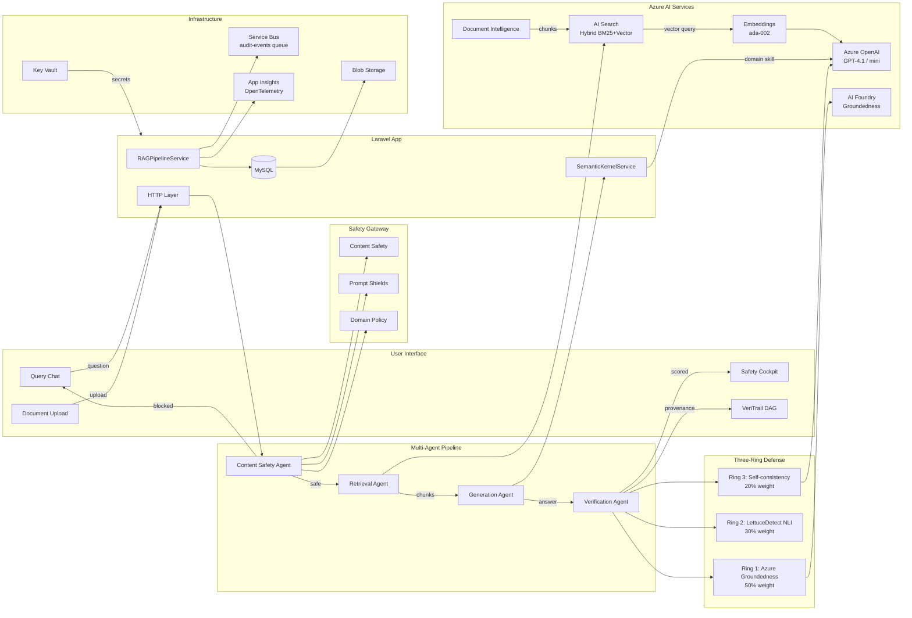

# Axiomeer

**Grounded, auditable AI for regulated professional domains — powered by Azure AI**

Built for the [Microsoft Innovate Challenge 2026](https://aka.ms/innovate-challenge) — Challenge: Enterprise AI Safety & Responsible AI

---

## What is Axiomeer?

Axiomeer is a multi-agent RAG (Retrieval-Augmented Generation) platform built for Legal, Healthcare, and Finance professionals. Every answer is verified through a three-ring hallucination defense, traced through a provenance DAG, and scored before it reaches the user. Nothing leaves the pipeline unverified.

### The Problem
Regulated professionals can't trust AI answers they can't audit. A healthcare query that returns a hallucinated drug interaction, or a legal answer citing a fabricated case, isn't just wrong — it's dangerous. Generic RAG systems have no per-domain safety policies and no way to trace *why* an answer was given.

### The Solution

```
User asks question → Safety screening → Hybrid search → SK orchestrates generation → Three-ring defense verifies → Safety Cockpit shown
```

---

## Architecture



---

## The 4 Agents

| Agent | Role | Input | Output |
|---|---|---|---|
| **Content Safety** | Screens input for harm + jailbreaks | User question | Safe/blocked + shield result |
| **Retrieval** | Hybrid BM25 + vector search with RRF | Question + domain | Ranked chunks with scores |
| **Generation** | SK-orchestrated answer via model router | Chunks + system prompt | Grounded answer + SK skill used |
| **Verification** | Three-ring hallucination defense | Answer + sources | Composite score + claim analysis |

---

## Safety Scoring

| Score | Level | Action |
|---|---|---|
| ≥ threshold | Green — Grounded | Answer shown normally |
| 60–threshold | Yellow — Review Needed | Answer shown with ungrounded segments flagged |
| < 60% | Red — Blocked | Answer suppressed, user warned |

Domain thresholds: Healthcare ≥ 90% · Legal ≥ 80% · Finance ≥ 75%

---

## Tech Stack

- **Backend**: Laravel 12 (PHP 8.2)
- **Frontend**: Bootstrap 5 (Reback theme), Iconify, vis.js (VeriTrail DAG)
- **Orchestration**: SemanticKernelService — SK Skills, Planner, Memory in PHP
- **AI Models**: Azure OpenAI GPT-4.1 + GPT-4.1-mini (model router), text-embedding-ada-002
- **Search**: Azure AI Search — hybrid BM25 + HNSW vector (1536-dim, cosine), RRF fusion
- **Safety**: Azure Content Safety, Prompt Shields, AI Foundry Groundedness API
- **Infrastructure**: Azure Key Vault, Azure Service Bus, Azure Blob Storage
- **Observability**: Application Insights, OpenTelemetry trace/span per agent run
- **Database**: MySQL 8

---

## Getting Started

```bash
composer install
cp .env.example .env
php artisan key:generate
php artisan migrate
php artisan storage:link
php artisan serve
```

Fill in Azure credentials in `.env` — see `config/azure.php` for all keys.

Update the Azure AI Search index with vector field support:

```bash
php scripts/update-search-index.php
```

### Key Environment Variables

```env
AZURE_OPENAI_ENDPOINT=
AZURE_OPENAI_API_KEY=
AZURE_OPENAI_DEPLOYMENT=gpt-4.1-mini-2
AZURE_OPENAI_COMPLEX_DEPLOYMENT=gpt-4.1
AZURE_OPENAI_EMBEDDING_DEPLOYMENT=text-embedding-ada-002
AZURE_AI_SEARCH_ENDPOINT=
AZURE_AI_SEARCH_KEY=
AZURE_AI_SEARCH_INDEX=axiomeer-knowledge
AZURE_CONTENT_SAFETY_ENDPOINT=
AZURE_CONTENT_SAFETY_KEY=
AZURE_KEY_VAULT_URI=
AZURE_SERVICE_BUS_CONNECTION=
```

---

## Project Structure

```
Axiomeer/
├── app/
│   ├── Http/Controllers/
│   │   ├── QueryController.php          # RAG pipeline entry point
│   │   ├── DocumentController.php       # Upload + chunk + index
│   │   ├── SettingsController.php       # Domain config + AI prompt gen
│   │   └── ProfileController.php        # Profile + avatar upload
│   ├── Services/
│   │   ├── RAGPipelineService.php       # 4-stage agent orchestrator
│   │   ├── SemanticKernelService.php    # SK Skills, Planner, Memory
│   │   └── Azure/
│   │       ├── AzureOpenAIService.php   # GPT + embeddings
│   │       ├── AzureSearchService.php   # Hybrid search
│   │       ├── ContentSafetyService.php # Harm + groundedness
│   │       ├── FoundryAgentService.php  # Foundry groundedness
│   │       ├── KeyVaultService.php      # Secret retrieval (IMDS/SAS)
│   │       └── ServiceBusService.php    # Async audit queue
│   └── Models/                          # 8 Eloquent models
├── database/migrations/                 # 12 migration files
├── resources/views/
│   ├── query/                           # Chat UI + Safety Cockpit + VeriTrail
│   ├── documents/                       # Upload + library
│   ├── architecture.blade.php           # Live architecture diagram
│   └── partials/
│       └── architecture-diagram.blade.php
├── scripts/
│   └── update-search-index.php          # Add vector field to AI Search index
├── routes/web.php
└── config/azure.php                     # All Azure service config
```

---

## Hackathon Challenge

**Microsoft Innovate Challenge 2026 — Enterprise AI Safety & Responsible AI**

Judging criteria (25% each): Performance · Innovation · Azure Breadth · Responsible AI

Axiomeer demonstrates:
- **Multi-agent orchestration**: 4 specialized agents in a sequential pipeline with fallbacks
- **Azure breadth**: 11 Azure services integrated — OpenAI, AI Search, Content Safety, AI Foundry, Document Intelligence, Speech, Key Vault, Service Bus, Blob Storage, App Insights, AI Foundry Agents
- **Responsible AI**: Per-domain safety thresholds, three-ring hallucination defense, full provenance DAG, audit trail
- **Innovation**: Semantic Kernel patterns in PHP, hybrid BM25+vector search, VeriTrail DAG visualization

---

Built with Laravel, Azure OpenAI, and Azure AI Services
