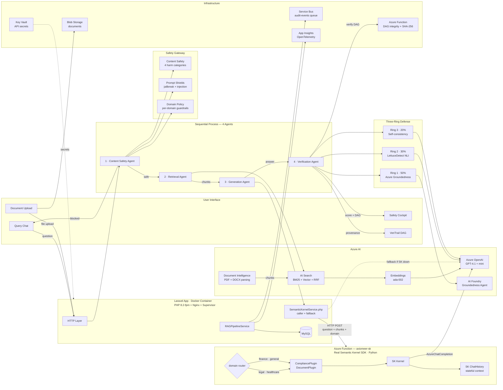

# Axiomeer

**Grounded, auditable AI for regulated professional domains — powered by Azure AI**

Built for the [Microsoft Innovate Challenge 2026](https://aka.ms/innovate-challenge) — Challenge: Enterprise AI Safety & Responsible AI

---

## What is Axiomeer?

Axiomeer is a multi-agent RAG platform for Legal, Healthcare, and Finance professionals. Every answer passes through a four-stage agent pipeline, is scored by a three-ring hallucination defense, and traced through a provenance DAG before reaching the user. Nothing leaves the pipeline unverified.

### The Problem
Regulated professionals can't trust AI answers they can't audit. A hallucinated drug interaction or a fabricated case citation isn't just wrong — it's dangerous. Generic RAG systems have no per-domain safety policies and no way to trace *why* an answer was given.

### The Solution
```
User question → Safety screening → Hybrid search → SK orchestrates generation → Three-ring defense → Safety Cockpit shown
```

---

## Architecture



---

## The 4 Agents — Sequential Process Pattern

Each agent runs in strict order, passing its output as input to the next. This is the **Sequential Process** pattern from the Semantic Kernel SDK — deterministic, guardrailed, no fan-out.

| # | Agent | Role | Azure Service | Output |
|---|---|---|---|---|
| 1 | **Content Safety** | Screen input for harm + jailbreaks | Content Safety + Prompt Shields | safe/blocked, shield result |
| 2 | **Retrieval** | Hybrid BM25 + vector search with RRF | AI Search + Embeddings (ada-002) | Ranked chunks with scores |
| 3 | **Generation** | Real SK Sequential Process via Azure Function | axiomeer-sk (Python, semantic-kernel SDK) → GPT-4.1-mini / GPT-4.1 | Grounded answer, SK plugin used |
| 4 | **Verification** | Three-ring hallucination defense + RAGAS | AI Foundry + OpenAI NLI | Composite score + claim verdicts |

### SK Agent 3 — Plugin Routing

```
domain = legal or healthcare  →  CompliancePlugin  (citation-enforced, regulatory tone)
domain = finance or general   →  DocumentPlugin    (standard grounded Q&A)
                                       ↓
                              SK Kernel + ChatHistory (stateful)
                                       ↓
                              AzureChatCompletion → GPT-4.1-mini / GPT-4.1
```

---

## Safety Scoring

| Composite Score | Level | Action |
|---|---|---|
| ≥ domain threshold | Green — Grounded | Answer delivered normally |
| 60% – threshold | Yellow — Review Needed | Answer shown with ungrounded segments flagged |
| < 60% | Red — Blocked | Answer suppressed, user warned |

**Domain thresholds:** Healthcare ≥ 90% · Legal ≥ 80% · Finance ≥ 75%

**Composite formula:** `(Ring1 × 0.50) + (Ring2 × 0.30) + (Ring3 × 0.20)`

---

## Three-Ring Defense

| Ring | Method | Weight |
|---|---|---|
| **Ring 1** — Azure Groundedness | AI Foundry GroundednessEvaluator agent (threads/runs API), 1–5 rubric normalized to 0–1 | 50% |
| **Ring 2** — LettuceDetect NLI | LLM-as-NLI-judge: decompose answer into atomic claims, classify each as supported/unsupported | 30% |
| **Ring 3** — Self-consistency | N=3 samples at temperature 0.7, measure claim agreement across samples as confidence proxy | 20% |

---

## VeriTrail DAG

Every answer produces a provenance DAG — a directed acyclic graph tracing every pipeline step with per-claim backward edges to source documents.

```
[User Question] → [Safety Gate] → [Retrieval] → [Generation] → [Ring1] [Ring2] [Ring3] → [Answer]
                                       ↑                ↓
                                  [Source 0]       [Claim 0] ← supported by → [Source 0]
                                  [Source 1]       [Claim 1] ← unsupported
```

Each DAG is verified by an **Azure Function** (Node.js) that runs:
- Structural validation — all required pipeline nodes present
- Acyclicity check — Kahn's topological sort
- Claim trace completeness — every claim has a backward edge
- SHA-256 integrity hash — tamper-evident fingerprint

---

## Tech Stack

- **Backend**: Laravel 12, PHP 8.2
- **Frontend**: Bootstrap 5 (Reback theme), Iconify, vis.js (interactive VeriTrail DAG)
- **Orchestration**: Real Semantic Kernel SDK (Python Azure Function) + SemanticKernelService.php caller
- **AI Models**: Azure OpenAI GPT-4.1 + GPT-4.1-mini (model router), text-embedding-ada-002
- **Search**: Azure AI Search — hybrid BM25 + HNSW vector (1536-dim, cosine), RRF fusion
- **Safety**: Azure Content Safety, Prompt Shields, AI Foundry Groundedness Agent
- **Documents**: Azure Document Intelligence (PDF, DOCX, images → chunks)
- **Infrastructure**: Azure Key Vault, Azure Service Bus (audit queue), Azure Blob Storage
- **Observability**: Application Insights, OpenTelemetry trace\_id + span\_id per agent run
- **Verification**: Azure Functions (Node.js) — DAG integrity + SHA-256
- **Database**: MySQL 8
- **Container**: Docker (PHP 8.2-fpm + Nginx + Supervisor), docker-compose for local dev

---

## Getting Started

### Local (XAMPP / artisan)

```bash
composer install
cp .env.example .env
php artisan key:generate
php artisan migrate
php artisan storage:link
php artisan serve
```

Update the Azure AI Search index schema to add the vector field:

```bash
php scripts/update-search-index.php
```

### Docker

```bash
cp .env.example .env   # fill in Azure credentials
docker compose up --build
php artisan migrate     # run inside container or set up entrypoint
```

The app runs on `http://localhost:8000`. The Dockerfile uses PHP 8.2-fpm + Nginx + Supervisor on Alpine Linux, builds frontend assets at image build time, and keeps storage in a named volume.

---

## Environment Variables

```env
# Azure OpenAI
AZURE_OPENAI_ENDPOINT=
AZURE_OPENAI_API_KEY=
AZURE_OPENAI_DEPLOYMENT=gpt-4.1-mini-2
AZURE_OPENAI_COMPLEX_DEPLOYMENT=gpt-4.1
AZURE_OPENAI_EMBEDDING_DEPLOYMENT=text-embedding-ada-002

# Azure AI Search
AZURE_AI_SEARCH_ENDPOINT=
AZURE_AI_SEARCH_KEY=
AZURE_AI_SEARCH_INDEX=axiomeer-knowledge

# Azure Content Safety
AZURE_CONTENT_SAFETY_ENDPOINT=
AZURE_CONTENT_SAFETY_KEY=

# Azure AI Foundry
FOUNDRY_AGENT_ENDPOINT=
FOUNDRY_AGENT_API_KEY=
FOUNDRY_AGENT_ID=

# Azure Document Intelligence
AZURE_DOCUMENT_INTELLIGENCE_ENDPOINT=
AZURE_DOCUMENT_INTELLIGENCE_KEY=

# Azure Key Vault
AZURE_KEY_VAULT_URI=

# Azure Service Bus
AZURE_SERVICE_BUS_CONNECTION=
```

---

## Project Structure

```
Axiomeer/
├── app/
│   ├── Http/Controllers/
│   │   ├── QueryController.php          # RAG pipeline entry point
│   │   ├── DocumentController.php       # Upload → parse → chunk → index
│   │   ├── SettingsController.php       # Domain config + AI prompt generation
│   │   └── ProfileController.php        # Profile + avatar upload
│   ├── Services/
│   │   ├── RAGPipelineService.php       # 4-stage agent orchestrator
│   │   ├── SemanticKernelService.php    # SK Skills, Planner, Memory
│   │   └── Azure/
│   │       ├── AzureOpenAIService.php   # GPT completions + embeddings
│   │       ├── AzureSearchService.php   # Hybrid BM25 + vector search
│   │       ├── ContentSafetyService.php # Harm detection + groundedness
│   │       ├── FoundryAgentService.php  # Ring 1 groundedness evaluator
│   │       ├── KeyVaultService.php      # Secret retrieval (IMDS/SAS auth)
│   │       └── ServiceBusService.php    # Async audit event queue
│   └── Models/                          # 8 Eloquent models
├── database/migrations/                 # 13 migration files
├── resources/views/
│   ├── query/                           # Chat UI + Safety Cockpit + VeriTrail
│   ├── documents/                       # Upload + library
│   ├── architecture.blade.php           # Live architecture diagram page
│   └── partials/architecture-diagram.blade.php
├── scripts/
│   └── update-search-index.php          # Add vector field to AI Search index
├── routes/web.php
└── config/azure.php                     # All Azure service configuration
```

---

## Hackathon Challenge

**Microsoft Innovate Challenge 2026 — Enterprise AI Safety & Responsible AI**

Judging criteria (25% each): Performance · Innovation · Azure Breadth · Responsible AI

Axiomeer demonstrates:
- **Multi-agent orchestration**: 4 specialized agents in a sequential pipeline with graceful fallbacks at every stage
- **Azure breadth**: 11 Azure services — OpenAI, AI Search, Content Safety, AI Foundry, Document Intelligence, Speech, Key Vault, Service Bus, Blob Storage, App Insights, Azure Functions
- **Responsible AI**: Per-domain safety thresholds, three-ring hallucination defense, full provenance DAG, immutable audit trail, RAGAS evaluation on every query
- **Innovation**: Semantic Kernel patterns in PHP, hybrid BM25+vector retrieval, interactive VeriTrail DAG visualization (vis.js), domain-aware SK skill routing

---

Built with Laravel, Azure OpenAI, and Azure AI Services
