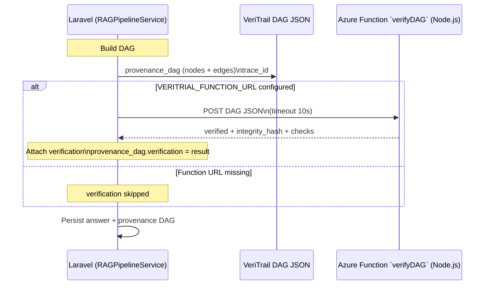

# Axiomeer

**Grounded, auditable AI for regulated professional domains — powered by Azure AI**

Built for the [Microsoft Innovate Challenge 2026](https://aka.ms/innovate-challenge) — Challenge: Enterprise AI Safety & Responsible AI

---

## What is Axiomeer?

Axiomeer is a multi-agent RAG platform for Legal, Healthcare, and Finance professionals. Every answer passes through a four-stage agent pipeline, is scored by a three-ring hallucination defense, and traced through a provenance DAG before reaching the user. Nothing leaves the pipeline unverified.

### The Problem
Regulated professionals can't trust AI answers they can't audit. A hallucinated drug interaction or a fabricated case citation isn't just wrong — it's dangerous. Generic RAG systems have no per-domain safety policies and no way to trace *why* an answer was given.

### The Solution
```
User question → Safety screening → Hybrid search → SK orchestrates generation → Three-ring defense → Safety Cockpit shown
```

---

## Architecture

```mermaid
flowchart TD
    subgraph UI["User Interface"]
        Q[Query Chat]
        DOC[Document Upload]
        COCKPIT[Safety Cockpit]
        VDAG[VeriTrail DAG]
    end

    subgraph App["Laravel App · Docker Container\nPHP 8.2-fpm + Nginx + Supervisor"]
        HTTP[HTTP Layer]
        RAG[RAGPipelineService]
        SKPHP[SemanticKernelService.php\ncaller + fallback]
    end

    subgraph Gateway["Safety Gateway"]
        CS[Content Safety\n4 harm categories]
        PS[Prompt Shields\njailbreak + injection]
        DP[Domain Policy\nper-domain guardrails]
    end

    subgraph Pipeline["Sequential Process — 4 Agents"]
        A1[1 · Content Safety Agent]
        A2[2 · Retrieval Agent]
        A3[3 · Generation Agent]
        A4[4 · Verification Agent]
    end

    subgraph SKFn["Azure Function App — axiomeer-sk\nReal Semantic Kernel SDK · Python"]
        SKKERNEL[SK Kernel]
        SKPLUGIN[CompliancePlugin\nDocumentPlugin]
        SKHIST[SK ChatHistory\nstateful context]
        SKROUTE{domain router}
    end

    subgraph Ingest["Document Ingestion Path"]
        UPLOAD[Upload endpoint]
        PARSE[Document Intelligence parse]
        CHUNK[Chunk + enrich metadata]
        INDEX[AI Search index write]
    end

    subgraph AzureAI["Azure AI"]
        AOAI[Azure OpenAI\nGPT-4.1 + mini]
        EMB[Embeddings\nada-002]
        SEARCH[AI Search\nBM25 + Vector + RRF]
        FOUND[AI Foundry\nGroundedness Agent]
        DOCINTEL[Document Intelligence\nPDF + DOCX parsing]
    end

    subgraph Defense["Three-Ring Defense"]
        R1[Ring 1 · 50%\nAzure Groundedness]
        R2[Ring 2 · 30%\nLettuceDetect NLI]
        R3[Ring 3 · 20%\nSelf-consistency]
    end

    subgraph Infra["Infrastructure + Ops"]
        KV[Key Vault\nAPI secrets (provisioned / optional)]
        SB[Service Bus\naudit-events queue (provisioned / not wired)]
        BLOB[Blob Storage\ndocuments (optional)]
        AI[App Insights\nOpenTelemetry]
        FNDAG[Azure Function — verifyDAG\nDAG integrity + SHA-256]
        DB[(Azure MySQL\nFlexible Server)]
    end

    %% === 1. CORE USER FLOW ===
    UI -->|"1. User query"| App
    App -->|"2. Trigger Pipeline"| Pipeline
    Pipeline -->|"3. Output & trace"| UI

    %% === 1B. DOCUMENT INGESTION FLOW ===
    UI -->|"Upload documents"| Ingest
    Ingest -->|"Store + index artifacts"| Infra
    PARSE -->|"Extract text/tables"| CHUNK
    CHUNK -->|"Generate chunk embeddings"| EMB
    EMB -->|"Attach vectors to index docs"| INDEX

    %% === 2. AGENT RELATIONSHIPS ===
    A1 -.->|"Evaluates text safety"| Gateway
    A2 -.->|"Hybrid Search"| AzureAI
    A2 -.->|"Generate query embedding"| EMB
    A3 -.->|"Delegates generation"| SKFn
    SKFn -.->|"AzureChatCompletion"| AzureAI
    A4 -.->|"Assess answer quality"| Defense
    Defense -.->|"Scoring"| AzureAI

    %% === 3. INFRASTRUCTURE & BACKEND ===
    App -.->|"Logs, metrics, storage"| Infra
    Pipeline -.->|"DAG tamper proofing call"| FNDAG
    FNDAG -.->|"Verification result + hash"| Pipeline
    Pipeline -.->|"Persist answer/citations/metrics"| DB
    Pipeline -.->|"(future) async audit events"| SB
    App -.->|"Tracing spans"| AI
```

---

## The 4-Stage Agent Pipeline (Sequential Process Pattern)

Axiomeer ditches the concept of a single "all-knowing" AI. Instead, it utilizes a **Multi-Agent Sequential Process**, an architectural pattern borrowed directly from the Semantic Kernel playbook. This ensures that every query is passed along an assembly line of highly specialized, single-purpose agents. 

1. **Safety Gateway Agent**: Before a query ever reaches an LLM, it is intercepted and evaluated against Azure AI Content Safety and Azure Prompt Shields. It strictly blocks jailbreak attempts and harmful language (hate, violence, self-harm).
2. **Retrieval Agent**: Acts as the system's librarian. It executes a **Hybrid Search**—running both a traditional BM25 keyword search and a heavy 1536-dimensional semantic vector search—then mathematically merges the best results using Reciprocal Rank Fusion (RRF). 
3. **Generation Agent (Semantic Kernel)**: This is the brain of the operation. Orchestrated by a Python-based Azure Function running the Microsoft Semantic Kernel SDK, this agent dynamically selects a "Skill Plugin" based on the user's domain (Healthcare vs. Legal). It securely injects the retrieved context and uses stateful Memory tracking to format a rigorously grounded system prompt.
4. **Verification Agent**: The final gatekeeper. Rather than trusting the generated text, this agent decomposes the output into individual claims and scores every single sentence using the Three-Ring Defense before it is allowed to reach the end-user.

---

## The Three-Ring Hallucination Defense

In regulated domains like Finance and Healthcare, hallucinating a single fact can result in catastrophic liability. To counter this, Axiomeer implements a **Three-Ring Defense** layer—a multi-faceted hallucination detection engine that evaluates every generated answer mathematically.

| Ring | Defense Mechanism | Explanation | Weight |
|---|---|---|---|
| **Ring 1** | **Azure Groundedness Agent** | Submits the Prompt and Answer to an autonomous AI Foundry Agent. It grades the response against a rigorous 1-5 evaluation rubric for strict contextual grounding, establishing the baseline truth score. | **50%** |
| **Ring 2** | **LettuceDetect (NLI)** | Operates as an LLM-as-a-judge using Natural Language Inference (NLI). This ring slices the final answer into isolated, atomic claims and individually attempts to map them directly back to the source chunks. Any unmapped claims are flagged as unsupported. | **30%** |
| **Ring 3** | **Self-Consistency Sampling** | Forces the LLM to generate the exact same answer 3 separate times at a slightly higher temperature. It then measures the variance. If the AI fluctuates wildly in its claims, confidence plummets. | **20%** |

### Dynamic Safety Scoring

Once the rings compute the final composite percentage, the system checks the **Domain Policy Drop-Threshold**:
- **Healthcare**: Requires ≥ 90% Grounding.
- **Legal**: Requires ≥ 80% Grounding.
- **Finance**: Requires ≥ 75% Grounding.

If an answer falls below the threshold, it is aggressively suppressed and replaced with a strict warning. If it falls marginally on the safety line, the UI visibly flags the specific ungrounded sentences for manual human review.

---

## VeriTrail Provenance DAG

It's not enough for an AI to be correct; it must be completely auditable. Enter the **VeriTrail DAG (Directed Acyclic Graph)**.

Every single time Axiomeer generates an answer, it automatically maps out a cryptographic, visual dependency graph of how that exact string of text came to exist. Starting from the very specific **Atomic Claim** the AI made, VeriTrail draws backward dependency routing arrows identifying exactly which sentence in which original uploaded document inspired the generation. 

### VeriTrail Verification Function (`verifyDAG`)

After the DAG is built in `RAGPipelineService::buildProvenanceDag()`, Axiomeer optionally calls the **Node.js Azure Function** `verifyDAG` (HTTP trigger) to validate structural integrity and provenance requirements.

If `VERITRIAL_FUNCTION_URL` is not configured, verification is non-blocking and the pipeline continues without the function result.



`verifyDAG` returns:
- `verified` (boolean)
- `integrity_hash` (SHA-256 hex digest computed from a canonical DAG representation)
- `checks_passed` and `checks_total`
- `timestamp`

It also validates (high level):
- required pipeline nodes exist (`input`, `safety_gate`, `retrieval`, `generation`, `output`)
- the DAG is acyclic (topological sort succeeds)
- claim nodes are not orphaned (claim tracing edges exist)
- `safety_gate.passed === true`
- all three verification ring nodes exist (`ring1`, `ring2`, `ring3`)

`verifyDAG` checks in more detail (matches the deployed `verifyDAG.js` logic):
- **Structural validity**: DAG contains required nodes and has `nodes` + `edges`
- **Acyclicity**: topological sort succeeds (no cycles)
- **Claim trace completeness**: every `claim` node has a supporting/producing edge back to the DAG
- **Safety gate**: finds `safety_gate` and verifies its `passed` flag is `true`
- **Three-ring coverage**: ensures `ring1`, `ring2`, and `ring3` are present (and records their scores)
- **Integrity hash**: computes SHA-256 over a canonical JSON of `trace_id`, nodes (id/type/score), and edges (from/to/label)

**Tamper-Proof Verification:**
Because these trails must hold up in regulatory audits, each generated DAG is passed through a distinct Node.js Azure Function. This function validates the graph structure (ensuring there are no cyclical dead-ends that could crash the UI), ensures no claims were "orphaned" without a source, and signs the graph sequence with an immutable **SHA-256 Integrity Hash**. This hash establishes a tamper-evident fingerprint, guaranteeing to an auditor that the AI's logic path was never retroactively altered.

---

## Tech Stack

- **Backend**: Laravel 12, PHP 8.2
- **Frontend**: Bootstrap 5 (Reback theme), Iconify, vis.js (interactive VeriTrail DAG)
- **Orchestration**: Real Semantic Kernel SDK (Python Azure Function) + SemanticKernelService.php caller
- **AI Models**: Azure OpenAI GPT-4.1 + GPT-4.1-mini (model router), text-embedding-ada-002
- **Search**: Azure AI Search — hybrid BM25 + HNSW vector (1536-dim, cosine), RRF fusion
- **Safety**: Azure Content Safety, Prompt Shields, AI Foundry Groundedness Agent
- **Documents**: Azure Document Intelligence (PDF, DOCX, images → chunks)
- **Infrastructure**: Azure Key Vault, Azure Service Bus (audit queue), Azure Blob Storage
- **Observability**: Application Insights, OpenTelemetry trace\_id + span\_id per agent run
- **Verification**: Azure Functions (Node.js) — DAG integrity + SHA-256
- **Database**: Azure Database for MySQL Flexible Server
- **Container**: Docker (PHP 8.2-fpm + Nginx + Supervisor), docker-compose for local dev

---

## Getting Started

### Local (XAMPP / artisan)

```bash
composer install
cp .env.example .env
php artisan key:generate
php artisan migrate
php artisan storage:link
php artisan serve
```

Update the Azure AI Search index schema to add the vector field:

```bash
php scripts/update-search-index.php
```

### Docker

```bash
cp .env.example .env   # fill in Azure credentials
docker compose up --build
php artisan migrate     # run inside container or set up entrypoint
```

The app runs on `http://localhost:8000`. The Dockerfile uses PHP 8.2-fpm + Nginx + Supervisor on Alpine Linux, builds frontend assets at image build time, and keeps storage in a named volume.

---

## Environment Variables

```env
# Azure OpenAI
AZURE_OPENAI_ENDPOINT=
AZURE_OPENAI_API_KEY=
AZURE_OPENAI_DEPLOYMENT=gpt-4.1-mini-2
AZURE_OPENAI_COMPLEX_DEPLOYMENT=gpt-4.1
AZURE_OPENAI_EMBEDDING_DEPLOYMENT=text-embedding-ada-002

# Azure AI Search
AZURE_AI_SEARCH_ENDPOINT=
AZURE_AI_SEARCH_KEY=
AZURE_AI_SEARCH_INDEX=axiomeer-knowledge

# Azure Content Safety
AZURE_CONTENT_SAFETY_ENDPOINT=
AZURE_CONTENT_SAFETY_KEY=

# Azure AI Foundry
FOUNDRY_AGENT_ENDPOINT=
FOUNDRY_AGENT_API_KEY=
FOUNDRY_AGENT_ID=

# Azure Document Intelligence
AZURE_DOCUMENT_INTELLIGENCE_ENDPOINT=
AZURE_DOCUMENT_INTELLIGENCE_KEY=

# Azure Key Vault
AZURE_KEY_VAULT_URI=

# Azure Service Bus
AZURE_SERVICE_BUS_CONNECTION=
```

---

## Project Structure

```
Axiomeer/
├── app/
│   ├── Http/Controllers/
│   │   ├── QueryController.php          # RAG pipeline entry point
│   │   ├── DocumentController.php       # Upload → parse → chunk → index
│   │   ├── SettingsController.php       # Domain config + AI prompt generation
│   │   └── ProfileController.php        # Profile + avatar upload
│   ├── Services/
│   │   ├── RAGPipelineService.php       # 4-stage agent orchestrator
│   │   ├── SemanticKernelService.php    # SK Skills, Planner, Memory
│   │   └── Azure/
│   │       ├── AzureOpenAIService.php   # GPT completions + embeddings
│   │       ├── AzureSearchService.php   # Hybrid BM25 + vector search
│   │       ├── ContentSafetyService.php # Harm detection + groundedness
│   │       ├── FoundryAgentService.php  # Ring 1 groundedness evaluator
│   │       ├── KeyVaultService.php      # Secret retrieval (IMDS/SAS auth)
│   │       └── ServiceBusService.php    # Async audit event queue
│   └── Models/                          # 8 Eloquent models
├── database/migrations/                 # 13 migration files
├── resources/views/
│   ├── query/                           # Chat UI + Safety Cockpit + VeriTrail
│   ├── documents/                       # Upload + library
│   ├── architecture.blade.php           # Live architecture diagram page
│   └── partials/architecture-diagram.blade.php
├── scripts/
│   └── update-search-index.php          # Add vector field to AI Search index
├── routes/web.php
└── config/azure.php                     # All Azure service configuration
```

---

## Hackathon Challenge

**Microsoft Innovate Challenge 2026 — Enterprise AI Safety & Responsible AI**

Judging criteria (25% each): Performance · Innovation · Azure Breadth · Responsible AI

Axiomeer demonstrates:
- **Multi-agent orchestration**: 4 specialized agents in a sequential pipeline with graceful fallbacks at every stage
- **Azure breadth**: 11 Azure services — OpenAI, AI Search, Content Safety, AI Foundry, Document Intelligence, Speech, Key Vault, Service Bus, Blob Storage, App Insights, Azure Functions
- **Responsible AI**: Per-domain safety thresholds, three-ring hallucination defense, full provenance DAG, immutable audit trail, RAGAS evaluation on every query
- **Innovation**: Semantic Kernel patterns in PHP, hybrid BM25+vector retrieval, interactive VeriTrail DAG visualization (vis.js), domain-aware SK skill routing

---

Built with Laravel, Azure OpenAI, and Azure AI Services
